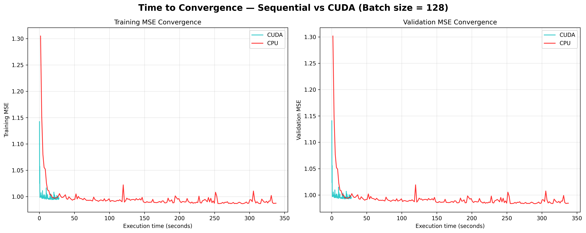
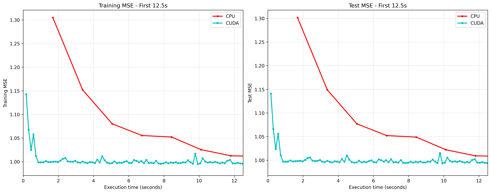
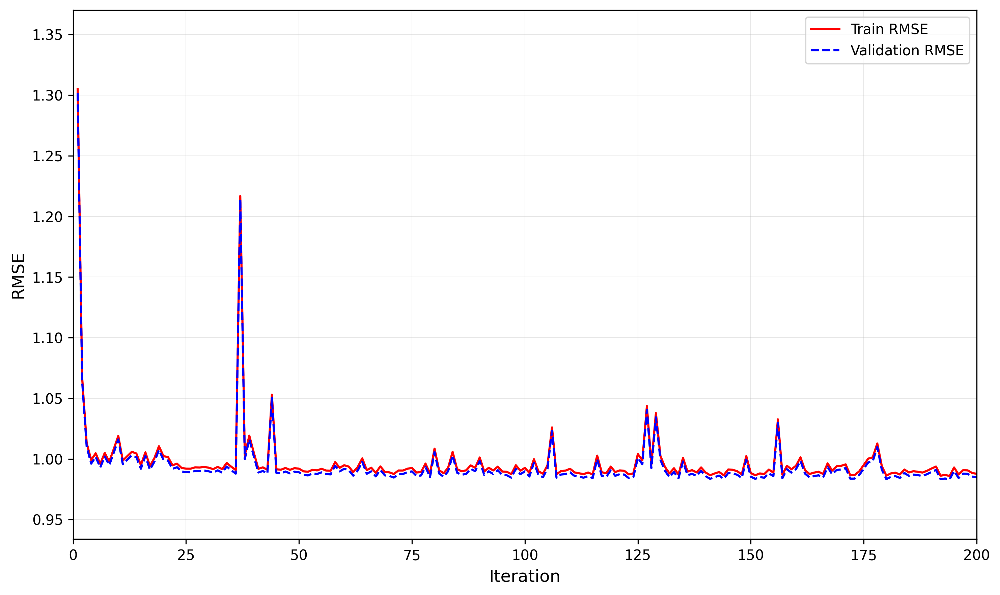

# Stochastic Gradient Descent (SGD) Performance Comparison on CPU (BLAS) and GPU (CUDA/cuBLAS)

**[ English | [한국어](README_ko.md) ]**

A high-performance implementation of Stochastic Gradient Descent (SGD) comparing sequential CPU execution (using BLAS) against GPU-accelerated CUDA implementation on a large-scale flight delay prediction dataset.

## 📊 Project Overview

This project implements and compares SGD optimization for linear regression on the **US Department of Transportation Flight Delays dataset** (5M+ records):

- **CPU Implementation**: Sequential C with BLAS (Basic Linear Algebra Subprograms)
- **GPU Implementation**: CUDA C with cuBLAS
- **Dataset**: 5,819,079 flight records → 5,714,008 after cleaning
- **Features**: 38 features (5 numerical + 33 categorical one-hot encoded) + bias term
- **Target**: DEPARTURE_DELAY (flight departure delay in minutes)

### Performance Results

| Metric | CPU Sequential | GPU CUDA | Speedup |
|--------|---------------|----------|---------|
| **Total Time** (200 iter) | 337s (~5.6 min) | 28s | **12x faster** |
| **Per Iteration** | ~1.69s | ~0.14s | **12x faster** |
| **Final Train RMSE** | 0.99 | 1.00 | Comparable |
| **Final Val RMSE** | 0.99 | 1.00 | Comparable |

**Conclusion**: GPU achieves **12x speedup** with equivalent convergence quality.

### Visualization Results

<p align="center">
  
  <br><em>Figure 1: CPU vs GPU convergence comparison over time (200 iterations)</em>
</p>

<p align="center">
  
  <br><em>Figure 2: Early convergence comparison - GPU completes 12x more iterations in 12.5 seconds</em>
</p>

<p align="center">
  
  <br><em>Figure 3: CPU Sequential RMSE evolution across 200 iterations</em>
</p>

---

## 🔗 Original Project & Attribution

### 🙏 Based on Daniel Sharp's Work

This project is a **reimplementation and extension** of the excellent work by **Daniel Sharp**:

> **"Implementation of Stochastic Gradient Descent in CUDA"**
>
> By Daniel Sharp
>
> - **Project Page**: https://dsharpc.github.io/SGD/

**Original Contributions by Daniel Sharp:**
- Core SGD, ADAM, and AMSGrad implementations in CUDA
- Sequential C implementation using BLAS
- Structure definitions and helper functions (`definitions.h`, `functions.c`)
- Original performance comparison methodology

**Our Enhancements & Additions:**
This repository builds upon Daniel Sharp's foundation by addressing missing components and adding new features:

### Key Differences & Improvements

#### 1. **Missing Files - Created from Scratch**
The original project referenced several files that were not provided in the repository:

- **`scaler_flights.R`**: R script for data preprocessing
  - ❌ Not provided
  - ✅ **Our solution**: Created `preprocess_flights.py` (Python) with enhanced features:
    - Fixed categorical encoding (always generates 38 features)
    - Standardized both X (numerical features) and y (target variable)
    - Proper train/validation split with consistent scaling

- **`download_data.py`**: Data download script
  - ❌ Not provided
  - ✅ **Our solution**: Created using Kaggle API (`kagglehub`)

#### 2. **Language Compatibility Issues - Fixed**
The original `SGD_CUDA.c` used Spanish variable names incompatible with English `definitions.h`:

- **Problem**:
  - Spanish types: `arreglo_2d_T`, `arreglo_1d_T`
  - Spanish macros: `entrada_vector` (not defined in `definitions.h`)
  - Header: `definiciones.h` (missing)

- ✅ **Our solution**: Created `SGD_CUDA_eng.c` with full English translation:
  - Types: `array_2d_T`, `array_1d_T`
  - Macros: `value_vector` (defined in `definitions.h`)
  - 13 macro replacements + variable name translations

#### 3. **Enhanced Features - Added**

- **Time Measurement**: Created `SGD_sequential_time.c` to measure CPU performance
- **Target Standardization**: Added y-variable scaling for RMSE ~1.0 (vs original ~1300)
- **Visualization Scripts**: 3 Python scripts for comprehensive result analysis
- **Detailed Documentation**: `PROJECT_LOG.md` with complete development history

---

## 🛠️ Requirements

### Hardware
- **GPU**: NVIDIA GPU with CUDA support (tested on RTX 4000 Ada, 20GB VRAM)
- **CPU**: Multi-core processor (tested on AMD EPYC 7352 24-Core, 48 threads)
- **RAM**: 8GB+ minimum, 16GB+ recommended (dataset uses ~2-3GB in memory)
  - Tested on: 251GB RAM system

### Software
- **CUDA Toolkit**: 12.0+ (tested on CUDA 12.8)
- **GCC**: C compiler with C99 support
- **BLAS/LAPACK**: Linear algebra libraries
- **Python**: 3.8+ with libraries:
  - `numpy`
  - `pandas`
  - `matplotlib`
  - `scikit-learn`
  - `kagglehub` (for data download)

---

## 📥 Installation & Setup

### 1. Clone Repository
```bash
git clone https://github.com/SeongEon-Kim/sgd-cpu-gpu-comparison.git
cd sgd-cpu-gpu-comparison
```

### 2. Install Python Dependencies
```bash
pip install numpy pandas matplotlib scikit-learn kagglehub
```

### 3. Download Dataset
```bash
python3 preprocessing/download_data.py
```
This downloads the Kaggle dataset to `data/flights.csv` (~565 MB).

### 4. Preprocess Data
```bash
python3 preprocessing/preprocess_flights.py
```
Generates:
- `X_train.txt` (1.4 GB) - Training features
- `y_train.txt` (38 MB) - Training labels
- `X_val.txt` (614 MB) - Validation features
- `y_val.txt` (17 MB) - Validation labels
- Scaling metadata files

### 5. Add Bias Term
```bash
bash preprocessing/preproc_flights.sh
```
Generates:
- `X_ent.txt` - Training with bias (39 features)
- `X_valida.txt` - Validation with bias (39 features)
- `b_bh.txt` - Initial weights (39 values = 0.1)

---

## 🚀 Usage

### CPU Sequential Execution

**Compile:**
```bash
gcc -Wall SGD_sequential_time.c functions.c -o sgd_time.out -lblas -lm
```

**Run:**
```bash
# 200 iterations, batch size 128
./sgd_time.out 3999805 39 1714203 128 200 -0.001

# 1000 iterations
./sgd_time.out 3999805 39 1714203 128 1000 -0.001
```

**Arguments:**
- `3999805` - Training samples
- `39` - Features (with bias)
- `1714203` - Validation samples
- `128` - Batch size
- `200`/`1000` - Iterations
- `-0.001` - Learning rate

### GPU CUDA Execution

**Compile:**
```bash
nvcc SGD_CUDA_eng.c functions.c -o cuda_program.out -lcublas
```

**Run:**
```bash
# 200 iterations, batch size 128, SGD optimizer
./cuda_program.out 3999805 39 1714203 128 200 1 0 0 0

# 1000 iterations
./cuda_program.out 3999805 39 1714203 128 1000 1 0 0 0
```

**Arguments:**
- First 6 same as CPU version
- `1` - Optimizer (1=SGD, 2=ADAM, 3=AMSGrad)
- `0 0 0` - Beta1, Beta2, Epsilon (for ADAM/AMSGrad, ignored for SGD)

---

## 📈 Visualization

### 1. Sequential RMSE Evolution
```bash
python3 visualization/1_sequential_rmse_evolution.py
```
Generates: `plots/rmse_evolution.png`

### 2. Early Convergence Comparison (First 12.5s)
```bash
python3 visualization/2_early_convergence_comparison.py
```
Generates: `plots/early_convergence_12_5s.png`

### 3. Full CPU vs GPU Comparison
```bash
python3 visualization/3_cpu_gpu_time_comparison.py
```
Generates:
- `plots/convergence_comparison_time_200.png` (time-based)
- `plots/convergence_comparison_iteration_200.png` (iteration-based)

---

## 📁 Project Structure

```
sgd-cpu-gpu-comparison/
├── README.md                          # This file (English)
├── README_ko.md                       # Korean version
│
├── preprocessing/                     # Data download & preprocessing
│   ├── download_data.py               # Download Kaggle dataset
│   ├── preprocess_flights.py          # Data preprocessing (Python)
│   └── preproc_flights.sh             # Add bias term & init weights
│
├── Core Implementation (C/CUDA)
│   ├── definitions.h                  # Type definitions and macros
│   ├── functions.c                    # Helper functions (I/O, batch sampling)
│   │
│   ├── SGD_sequential.c               # Original CPU implementation
│   ├── SGD_sequential_time.c          # CPU with time measurement
│   │
│   ├── SGD_CUDA.c                     # Original CUDA (Spanish, won't compile)
│   └── SGD_CUDA_eng.c                 # Fixed CUDA (English, working)
│
├── visualization/                     # Result visualization scripts
│   ├── 1_sequential_rmse_evolution.py
│   ├── 2_early_convergence_comparison.py
│   └── 3_cpu_gpu_time_comparison.py
│
└── Generated Files (not in git)
    ├── data/flights.csv               # Downloaded dataset (~565 MB)
    ├── X_train.txt, y_train.txt       # Preprocessed training data
    ├── X_val.txt, y_val.txt           # Preprocessed validation data
    ├── X_ent.txt, X_valida.txt        # Data with bias term
    ├── sgd_output_*.txt               # Execution results
    └── plots/                         # Generated visualization images
```

---

## 🧪 Experimental Details

### Dataset Processing
- **Original**: 5,819,079 records, 31 variables
- **After Cleaning**: 5,714,008 records (removed 105k with missing values)
- **Train/Val Split**: 70/30 (3,999,805 / 1,714,203)
- **Features**: 38 (5 numerical scaled + 33 categorical one-hot)
- **Target Scaling**: Standardized to mean=0, std=1 (RMSE ~1.0)

### Model Configuration
- **Algorithm**: Stochastic Gradient Descent (SGD)
- **Batch Size**: 128 (mini-batch)
- **Learning Rate**: 0.001
- **Iterations**: 200 / 1000
- **Loss Function**: Mean Squared Error (MSE)

### Environment
- **GPU**: NVIDIA RTX 4000 Ada Generation (20 GB VRAM)
- **CPU**: AMD EPYC 7352 24-Core Processor (48 threads)
- **RAM**: 251 GB DDR4
- **CUDA**: 12.8
- **BLAS**: OpenBLAS / Intel MKL
- **Platform**: Linux 6.8.0 (Ubuntu-based), RunPod GPU Instance

---

## 📊 Key Results

### Convergence Quality
- Both CPU and GPU implementations converge to **RMSE ~0.99-1.00**
- No overfitting observed (train/val RMSE similar)
- Convergence stabilizes after ~10 iterations

### Speed Comparison (200 iterations)
- **CPU Total**: 337 seconds
- **GPU Total**: 28 seconds
- **Speedup**: **12.0x**

### GPU Efficiency
- In the first 12.5 seconds:
  - CPU completes: ~7 iterations
  - GPU completes: ~90 iterations
- GPU performs **12x more iterations** in the same time

---

## 🔧 Troubleshooting

### CUDA Compilation Errors
If you see errors about `arreglo_2d_T` or `entrada_vector`:
- ✅ Use `SGD_CUDA_eng.c` (English version)
- ❌ Don't use `SGD_CUDA.c` (Spanish version, won't compile with `definitions.h`)

### BLAS Library Not Found
```bash
# Ubuntu/Debian
sudo apt-get install libblas-dev liblapack-dev

# CentOS/RHEL
sudo yum install blas-devel lapack-devel
```

### CUDA Not Found
```bash
# Check CUDA installation
nvcc --version
nvidia-smi

# Add to PATH if needed
export PATH=/usr/local/cuda/bin:$PATH
export LD_LIBRARY_PATH=/usr/local/cuda/lib64:$LD_LIBRARY_PATH
```

---

## 📝 Citation & Credits

### Primary Citation (Original Work)

**If you use this implementation, please cite Daniel Sharp's original work:**

```bibtex
@misc{sharp2020sgd,
  author = {Sharp, Daniel},
  title = {Implementation of Stochastic Gradient Descent in CUDA},
  year = {2020},
  url = {https://dsharpc.github.io/SGD/},
  note = {Original implementation and methodology}
}
```

### Secondary Citation (This Repository)

If you specifically use the enhancements from this repository (data preprocessing, visualizations, etc.):

```bibtex
@misc{sgdcudacomparison2025,
  title = {SGD CPU and GPU Performance Comparison},
  year = {2025},
  url = {https://github.com/SeongEon-Kim/sgd-cpu-gpu-comparison},
  note = {Extended implementation with preprocessing and visualization tools}
}
```

---

## 📄 License

This project follows the same license as the original work by Daniel Sharp.

---

## 🙏 Acknowledgments

### Primary Acknowledgment
- **Daniel Sharp** - Original SGD CUDA implementation, methodology, and tutorial. This project would not exist without his foundational work. All core algorithms (SGD, ADAM, AMSGrad) and the CUDA/BLAS implementation structure are based on his implementation.

### Additional Acknowledgments
- **Kaggle & US Department of Transportation** - Flight Delays Dataset
- **NVIDIA** - CUDA Toolkit and cuBLAS library
- **Erick Palacios** - Original structure definitions and helper functions (as mentioned in Daniel Sharp's work)

---

## 📧 Contact

For questions or issues, please open an issue on GitHub.

---

**Last Updated**: 2025-10-26 16:35 UTC
