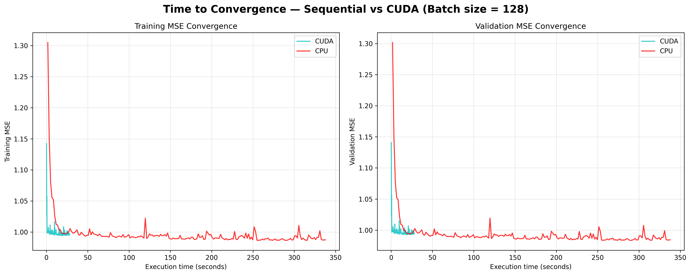
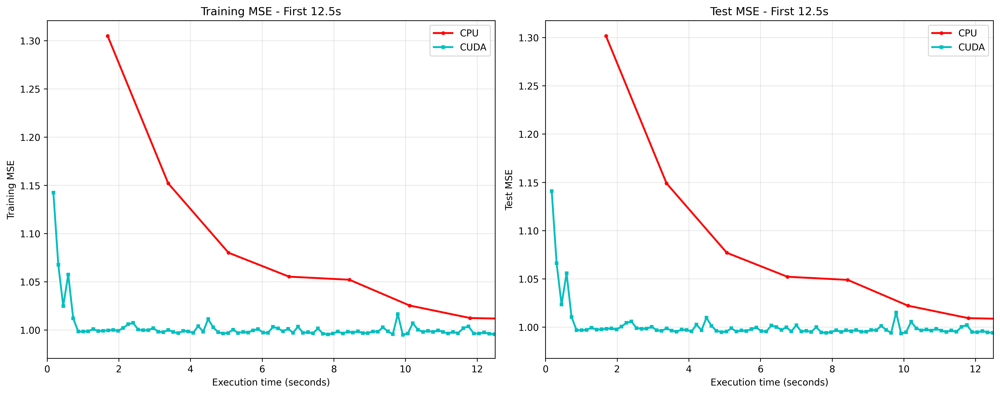
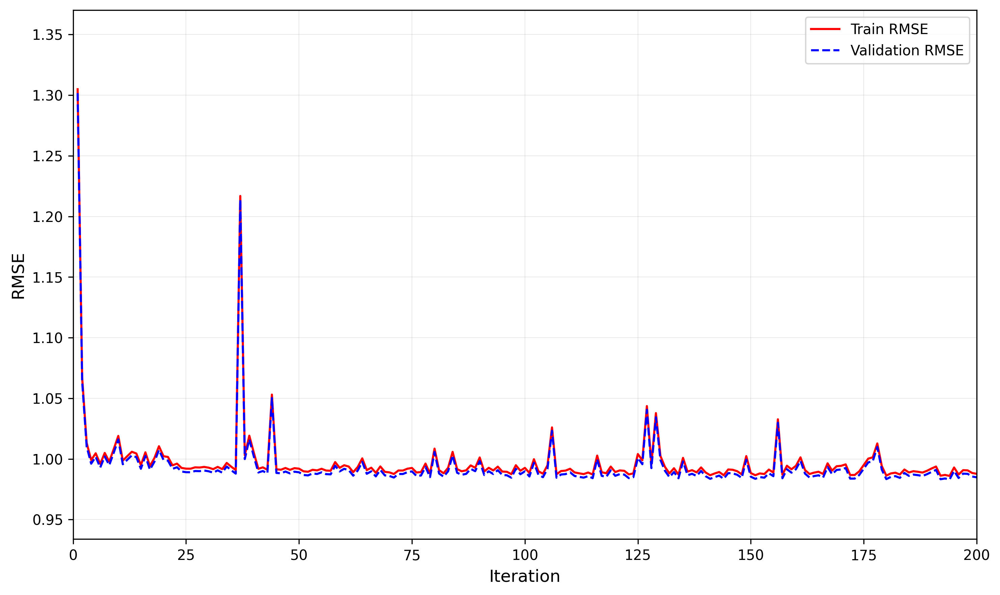

# CPU (BLAS)와 GPU (CUDA/cuBLAS) 환경에서의 확률적 경사하강법 (SGD) 성능 비교

**[ [English](README.md) | 한국어 ]**

대규모 항공 지연 예측 데이터셋을 활용하여 BLAS 기반 CPU와 GPU 가속 CUDA 구현의 확률적 경사하강법(SGD) 성능을 비교한 프로젝트입니다.

## 📊 프로젝트 개요

본 프로젝트는 **미국 교통부 항공 지연 데이터셋** (500만+ 레코드)을 대상으로 선형 회귀를 위한 SGD 최적화를 구현하고 비교합니다:

- **CPU 구현**: BLAS (Basic Linear Algebra Subprograms)를 사용한 순차 C 코드
- **GPU 구현**: cuBLAS를 사용한 CUDA C 코드
- **데이터셋**: 5,819,079개의 항공 기록 → 정제 후 5,714,008개
- **특성 (Features)**: 38개 (5개 수치형 + 33개 범주형 원-핫 인코딩) + 편향 항
- **목표 변수**: DEPARTURE_DELAY (항공기 출발 지연 시간, 분 단위)

### 성능 결과

| 지표 | CPU 순차 실행 | GPU CUDA | 속도 향상 |
|------|--------------|----------|-----------|
| **총 실행 시간** (200회 반복) | 337초 (~5.6분) | 28초 | **12배 빠름** |
| **반복당 시간** | ~1.69초 | ~0.14초 | **12배 빠름** |
| **최종 Train RMSE** | 0.99 | 1.00 | 동등 |
| **최종 Val RMSE** | 0.99 | 1.00 | 동등 |

**결론**: GPU는 동등한 수렴 품질로 **12배 속도 향상**을 달성했습니다.

### 시각화 결과

<p align="center">
  
  <br><em>그림 1: CPU vs GPU 수렴 비교 (시간 기준, 200회 반복)</em>
</p>

<p align="center">
  
  <br><em>그림 2: 초기 수렴 비교 - GPU는 12.5초 동안 12배 더 많은 반복 수행</em>
</p>

<p align="center">
  
  <br><em>그림 3: CPU 순차 실행의 RMSE 진화 (200회 반복)</em>
</p>

---

## 🔗 원본 프로젝트 및 출처

### 🙏 Daniel Sharp의 작업 기반

본 프로젝트는 **Daniel Sharp**의 작업을 **재구현하고 확장**한 것입니다:

> **"Implementation of Stochastic Gradient Descent in CUDA"**
>
> By Daniel Sharp
>
> - **프로젝트 페이지**: https://dsharpc.github.io/SGD/

**Daniel Sharp의 원본 기여:**
- CUDA 기반 SGD, ADAM, AMSGrad 핵심 구현
- BLAS를 사용한 순차 C 구현
- 구조 정의 및 헬퍼 함수 (`definitions.h`, `functions.c`)
- 원본 성능 비교 방법론

**본 저장소의 개선 및 추가 사항:**
본 저장소는 Daniel Sharp의 기반 위에 누락된 구성 요소를 해결하고 새로운 기능을 추가했습니다:

### 주요 차이점 및 개선 사항

#### 1. **누락된 파일 - 처음부터 새로 작성**
원본 프로젝트는 저장소에 제공되지 않은 여러 파일을 참조했습니다:

- **`scaler_flights.R`**: 데이터 전처리용 R 스크립트
  - ❌ 제공되지 않음
  - ✅ **본 저장소의 해결책**: Python으로 `preprocess_flights.py` 작성 (향상된 기능 포함):
    - 범주형 인코딩 수정 (항상 38개 특성 생성)
    - X (수치형 특성)와 y (목표 변수) 모두 표준화
    - 일관된 스케일링으로 train/validation 분할

- **`download_data.py`**: 데이터 다운로드 스크립트
  - ❌ 제공되지 않음
  - ✅ **본 저장소의 해결책**: Kaggle API (`kagglehub`) 사용하여 작성

#### 2. **언어 호환성 문제 - 수정**
원본 `SGD_CUDA.c`는 영어 `definitions.h`와 호환되지 않는 스페인어 변수명을 사용했습니다:

- **문제점**:
  - 스페인어 타입: `arreglo_2d_T`, `arreglo_1d_T`
  - 스페인어 매크로: `entrada_vector` (`definitions.h`에 정의되지 않음)
  - 헤더: `definiciones.h` (누락됨)

- ✅ **본 저장소의 해결책**: 완전한 영어 번역으로 `SGD_CUDA_eng.c` 작성:
  - 타입: `array_2d_T`, `array_1d_T`
  - 매크로: `value_vector` (`definitions.h`에 정의됨)
  - 13개 매크로 교체 + 변수명 번역

#### 3. **향상된 기능 - 추가**

- **시간 측정**: CPU 성능 측정을 위한 `SGD_sequential_time.c` 작성
- **목표 변수 표준화**: RMSE ~1.0을 위한 y 변수 스케일링 추가 (원본은 ~1300)
- **시각화 스크립트**: 포괄적인 결과 분석을 위한 Python 스크립트 3개
- **상세한 문서화**: 완전한 개발 히스토리를 담은 `PROJECT_LOG.md`

---

## 🛠️ 요구사항

### 하드웨어
- **GPU**: CUDA 지원 NVIDIA GPU (RTX 4000 Ada, 20GB VRAM에서 테스트됨)
- **CPU**: 멀티코어 프로세서 (AMD EPYC 7352 24-Core, 48 threads에서 테스트됨)
- **RAM**: 최소 8GB+, 권장 16GB+ (데이터셋은 메모리에서 ~2-3GB 사용)
  - 테스트 환경: 251GB RAM 시스템

### 소프트웨어
- **CUDA Toolkit**: 12.0+ (CUDA 12.8에서 테스트됨)
- **GCC**: C99 지원 C 컴파일러
- **BLAS/LAPACK**: 선형대수 라이브러리
- **Python**: 3.8+ 및 다음 라이브러리:
  - `numpy`
  - `pandas`
  - `matplotlib`
  - `scikit-learn`
  - `kagglehub` (데이터 다운로드용)

---

## 📥 설치 및 설정

### 1. 저장소 복제
```bash
git clone https://github.com/SeongEon-Kim/sgd-cpu-gpu-comparison.git
cd sgd-cpu-gpu-comparison
```

### 2. Python 의존성 설치
```bash
pip install numpy pandas matplotlib scikit-learn kagglehub
```

### 3. 데이터셋 다운로드
```bash
python3 preprocessing/download_data.py
```
Kaggle 데이터셋을 `data/flights.csv` (~565 MB)로 다운로드합니다.

### 4. 데이터 전처리
```bash
python3 preprocessing/preprocess_flights.py
```
다음 파일들을 생성합니다:
- `X_train.txt` (1.4 GB) - 훈련 특성
- `y_train.txt` (38 MB) - 훈련 레이블
- `X_val.txt` (614 MB) - 검증 특성
- `y_val.txt` (17 MB) - 검증 레이블
- 스케일링 메타데이터 파일들

### 5. 편향 항 추가
```bash
bash preprocessing/preproc_flights.sh
```
다음 파일들을 생성합니다:
- `X_ent.txt` - 편향 포함 훈련 데이터 (39개 특성)
- `X_valida.txt` - 편향 포함 검증 데이터 (39개 특성)
- `b_bh.txt` - 초기 가중치 (39개 값 = 0.1)

---

## 🚀 사용 방법

### CPU 순차 실행

**컴파일:**
```bash
gcc -Wall SGD_sequential_time.c functions.c -o sgd_time.out -lblas -lm
```

**실행:**
```bash
# 200회 반복, 배치 크기 128
./sgd_time.out 3999805 39 1714203 128 200 -0.001

# 1000회 반복
./sgd_time.out 3999805 39 1714203 128 1000 -0.001
```

**인자 설명:**
- `3999805` - 훈련 샘플 수
- `39` - 특성 수 (편향 포함)
- `1714203` - 검증 샘플 수
- `128` - 배치 크기
- `200`/`1000` - 반복 횟수
- `-0.001` - 학습률

### GPU CUDA 실행

**컴파일:**
```bash
nvcc SGD_CUDA_eng.c functions.c -o cuda_program.out -lcublas
```

**실행:**
```bash
# 200회 반복, 배치 크기 128, SGD 옵티마이저
./cuda_program.out 3999805 39 1714203 128 200 1 0 0 0

# 1000회 반복
./cuda_program.out 3999805 39 1714203 128 1000 1 0 0 0
```

**인자 설명:**
- 처음 6개는 CPU 버전과 동일
- `1` - 옵티마이저 (1=SGD, 2=ADAM, 3=AMSGrad)
- `0 0 0` - Beta1, Beta2, Epsilon (ADAM/AMSGrad용, SGD는 무시)

---

## 📈 시각화

### 1. 순차 RMSE 진화
```bash
python3 visualization/1_sequential_rmse_evolution.py
```
생성 파일: `plots/rmse_evolution.png`

### 2. 초기 수렴 비교 (첫 12.5초)
```bash
python3 visualization/2_early_convergence_comparison.py
```
생성 파일: `plots/early_convergence_12_5s.png`

### 3. 전체 CPU vs GPU 비교
```bash
python3 visualization/3_cpu_gpu_time_comparison.py
```
생성 파일:
- `plots/convergence_comparison_time_200.png` (시간 기준)
- `plots/convergence_comparison_iteration_200.png` (반복 기준)

---

## 📁 프로젝트 구조

```
sgd-cpu-gpu-comparison/
├── README.md                          # 영어 버전
├── README_ko.md                       # 한국어 버전 (이 파일)
│
├── preprocessing/                     # 데이터 다운로드 및 전처리
│   ├── download_data.py               # Kaggle 데이터셋 다운로드
│   ├── preprocess_flights.py          # 데이터 전처리 (Python)
│   └── preproc_flights.sh             # 편향 항 추가 및 가중치 초기화
│
├── 핵심 구현 (C/CUDA)
│   ├── definitions.h                  # 타입 정의 및 매크로
│   ├── functions.c                    # 헬퍼 함수 (I/O, 배치 샘플링)
│   │
│   ├── SGD_sequential.c               # 원본 CPU 구현
│   ├── SGD_sequential_time.c          # 시간 측정 포함 CPU 구현
│   │
│   ├── SGD_CUDA.c                     # 원본 CUDA (스페인어, 컴파일 불가)
│   └── SGD_CUDA_eng.c                 # 수정된 CUDA (영어, 작동)
│
├── visualization/                     # 결과 시각화 스크립트
│   ├── 1_sequential_rmse_evolution.py
│   ├── 2_early_convergence_comparison.py
│   └── 3_cpu_gpu_time_comparison.py
│
└── 생성 파일 (git 미포함)
    ├── data/flights.csv               # 다운로드된 데이터셋 (~565 MB)
    ├── X_train.txt, y_train.txt       # 전처리된 훈련 데이터
    ├── X_val.txt, y_val.txt           # 전처리된 검증 데이터
    ├── X_ent.txt, X_valida.txt        # 편향 항 포함 데이터
    ├── sgd_output_*.txt               # 실행 결과
    └── plots/                         # 생성된 시각화 이미지
```

---

## 🧪 실험 세부 사항

### 데이터셋 처리
- **원본**: 5,819,079개 레코드, 31개 변수
- **정제 후**: 5,714,008개 레코드 (결측값 있는 105k개 제거)
- **Train/Val 분할**: 70/30 (3,999,805 / 1,714,203)
- **특성**: 38개 (5개 수치형 스케일링 + 33개 범주형 원-핫)
- **목표 변수 스케일링**: 평균=0, 표준편차=1로 표준화 (RMSE ~1.0)

### 모델 설정
- **알고리즘**: Stochastic Gradient Descent (SGD)
- **배치 크기**: 128 (미니배치)
- **학습률**: 0.001
- **반복 횟수**: 200 / 1000
- **손실 함수**: Mean Squared Error (MSE)

### 실험 환경
- **GPU**: NVIDIA RTX 4000 Ada Generation (20 GB VRAM)
- **CPU**: AMD EPYC 7352 24-Core Processor (48 threads)
- **RAM**: 251 GB DDR4
- **CUDA**: 12.8
- **BLAS**: OpenBLAS / Intel MKL
- **플랫폼**: Linux 6.8.0 (Ubuntu 기반), RunPod GPU 인스턴스

---

## 📊 주요 결과

### 수렴 품질
- CPU와 GPU 구현 모두 **RMSE ~0.99-1.00**로 수렴
- 과적합 없음 (train/val RMSE 유사)
- 수렴은 ~10회 반복 후 안정화

### 속도 비교 (200회 반복)
- **CPU 총 시간**: 337초
- **GPU 총 시간**: 28초
- **속도 향상**: **12.0배**

### GPU 효율성
- 첫 12.5초 동안:
  - CPU 완료: ~7회 반복
  - GPU 완료: ~90회 반복
- GPU는 동일 시간에 **12배 더 많은 반복** 수행

---

## 🔧 문제 해결

### CUDA 컴파일 오류
`arreglo_2d_T` 또는 `entrada_vector`에 대한 오류가 표시되는 경우:
- ✅ `SGD_CUDA_eng.c` 사용 (영어 버전)
- ❌ `SGD_CUDA.c` 사용하지 말 것 (스페인어 버전, `definitions.h`와 컴파일 불가)

### BLAS 라이브러리를 찾을 수 없음
```bash
# Ubuntu/Debian
sudo apt-get install libblas-dev liblapack-dev

# CentOS/RHEL
sudo yum install blas-devel lapack-devel
```

### CUDA를 찾을 수 없음
```bash
# CUDA 설치 확인
nvcc --version
nvidia-smi

# 필요시 PATH 추가
export PATH=/usr/local/cuda/bin:$PATH
export LD_LIBRARY_PATH=/usr/local/cuda/lib64:$LD_LIBRARY_PATH
```

---

## 📝 인용 및 크레딧

### 주 인용 (원본 작업)

**본 구현을 사용하는 경우 Daniel Sharp의 원본 작업을 인용해주세요:**

```bibtex
@misc{sharp2020sgd,
  author = {Sharp, Daniel},
  title = {Implementation of Stochastic Gradient Descent in CUDA},
  year = {2020},
  url = {https://dsharpc.github.io/SGD/},
  note = {Original implementation and methodology}
}
```

### 부 인용 (본 저장소)

본 저장소의 개선 사항(데이터 전처리, 시각화 등)을 특별히 사용하는 경우:

```bibtex
@misc{sgdcudacomparison2025,
  title = {SGD CPU and GPU Performance Comparison},
  year = {2025},
  url = {https://github.com/SeongEon-Kim/sgd-cpu-gpu-comparison},
  note = {Extended implementation with preprocessing and visualization tools}
}
```

---

## 📄 라이선스

본 프로젝트는 Daniel Sharp의 원본 작업과 동일한 라이선스를 따릅니다.

---

## 🙏 감사의 말

### 주요 감사
- **Daniel Sharp** - 원본 SGD CUDA 구현, 방법론 및 튜토리얼 등의 모든 핵심 알고리즘(SGD, ADAM, AMSGrad) 및 CUDA/BLAS 구현 구조는 그의 구현을 기반으로 합니다.

### 추가 감사
- **Kaggle & 미국 교통부** - 항공 지연 데이터셋
- **NVIDIA** - CUDA Toolkit 및 cuBLAS 라이브러리
- **Erick Palacios** - 원본 구조 정의 및 헬퍼 함수 (Daniel Sharp의 작업에서 언급)

---

## 📧 연락처

질문이나 문제가 있는 경우 GitHub에서 이슈를 열어주세요.

---

**최종 업데이트**: 2025-10-26 17:00 UTC
